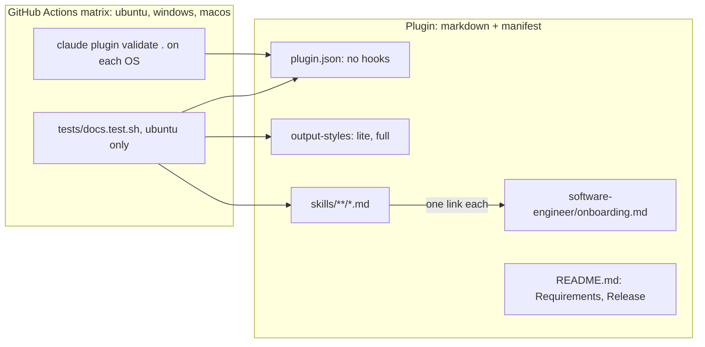

# cross-platform — Design Doc

## Context

ni 1.8.0 was built and tested on WSL only. Two kinds of platform coupling exist:

1. **Runtime coupling**: two hooks run `bash` scripts that shell out to `jq` and
   `python3`. This is the terse mechanism adapted from the upstream "caveman" project,
   and on the current Claude Code version it does not work at all: the injected level
   is ignored and replies stay at default length. The hooks go, the upstream mechanism
   is abandoned, and ni ships its own terse mode as output styles that must measurably
   beat Claude Code's built-in `Concise` style. See
   [ADR output-styles](./adrs/output-styles.md). After that the plugin has no runtime:
   markdown plus one JSON manifest.
2. **Content coupling**: skill reference files carry bash snippets with WSL paths,
   host-specific binaries, `/tmp`, GNU-only flags, and `python3` one-liners. Two
   language files encode one machine's toolchain. Claude follows these literally on
   the wrong platform and fails. See [ADR project-onboarding](./adrs/project-onboarding.md).

Target platforms: WSL (current), Linux, macOS, Windows native with its standard shells
(PowerShell, cmd). No shell is assumed: snippets are plain commands with flags that run
unchanged in bash, PowerShell, and cmd. Where an invocation differs per shell, the
skill shows each form. Git Bash is not a requirement of this plugin.

## Functional Requirements

### FR1 — Hook-based terse mode removed
No `scripts/`, no `hooks` block in [plugin.json](../../../.claude-plugin/plugin.json),
no terse skill folder, no state file. The 1.8.0 style, command, and skill are deleted;
FR10 rebuilds terse on output styles only. Planned as task 0, nothing is removed before
the plan is approved.

### FR2 — No upstream-project references outside NOTICE
README and skills carry no "adapted from" lines for the removed mode. The
[NOTICE](../../../NOTICE) keeps attribution for content that still derives from the
upstream project. Part of task 0.

### FR3 — Project onboarding replaces language files
[rust.md](../../../skills/software-engineer/rust.md) and
[dotnet.md](../../../skills/software-engineer/dotnet.md) are deleted. A new reference
[onboarding.md](../../../skills/software-engineer/onboarding.md) tells the agent how to
onboard on any existing project: host, project stack, target platform, package manager
and build system, CI pipeline as the source of truth for commands, repository
conventions, test and coverage tooling, variant selection with a host capability check,
command form, trace. [software-engineer/SKILL.md](../../../skills/software-engineer/SKILL.md)
gets a `## Onboarding` section that links it as the first step of every task. Generic
design opinions from the old files move to `## Code quality`. No language is named.

### FR4 — c4-graph render path is portable
[inputs.md](../../../skills/c4-graph/inputs.md) writes the HTML file with the Write
tool into the working directory, lists the Chrome binary location per OS, and offers a
decode step that needs no `python3`.

### FR5 — GitLab review payload needs no python3
[gitlab.md](../../../skills/code-review/gitlab.md) builds the `DiffNote` payload
without the `python3` heredoc. The payload file is written directly (Write tool, JSON
escaped body) and sent with `glab api --input`. Simple string fields use `-F key=@file`.

### FR6 — Link lint runs on BSD and GNU
[preflight.md](../../../skills/plan/templates/preflight.md) replaces `grep -rPn` with a
`git grep -nE` command that matches the same set of unlinked `.md` references.

### FR7 — Shell-neutral snippets, one owner
[onboarding.md](../../../skills/software-engineer/onboarding.md) owns the rule: a
snippet is one command per line, flags only, no shell syntax. Banned inside fenced
blocks in skills: `$(`, `${`, `<<`, `export `, `&&`, `||`, `2>/dev/null`, pipes to
`sort`, `uniq`, `grep`, `awk`, `sed`, `xargs`, `~/`, `/tmp`, `.exe`, `sudo`,
`python3`. Where bash, PowerShell, and cmd differ (wrapper scripts, environment
variables, temp and home directories, quoting), the file gives a three-column table and
the skills show each form on its own line. Every skill with command blocks links to it
once.

### FR8 — README states requirements per platform
README gains a Requirements section: Claude Code's own system requirements per OS,
`glab` or `gh` per forge, Chrome only for c4 PNG export, Claude Code 2.1.251 or later
for live style switching. Paths are given per OS: `~/.copilot`, `~/.cursor`,
`~/.gemini` and their `%USERPROFILE%` equivalents. The language rows in the skills
table become "any project that already builds, commands discovered from the project".

### FR9 — Version bump
[plugin.json](../../../.claude-plugin/plugin.json) moves to `2.0.0` (hook-based terse
mode and its command are removed, a breaking change for users of `/ni:terse`),
keywords drop `dotnet` and `rust`, gain `output-style`, `windows`, `macos`,
`cross-platform`.

### FR10 — Two terse output styles
[lite.md](../../../output-styles/lite.md) and [full.md](../../../output-styles/full.md),
surfaced by Claude Code as `ni:lite` and `ni:full` (evidence: the 1.8.0 file
[terse.md](../../../output-styles/terse.md) is reported as `ni:terse`). Frontmatter `description`,
`keep-coding-instructions: true`, no `force-for-plugin`. Each body under 60 lines,
written fresh for ni. `off` is `/output-style default`. No `/ni:terse` command: the
built-in `/output-style` switches and persists. Both styles ship only once NFR7 shows
they beat the built-in `Concise` style. See [ADR output-styles](./adrs/output-styles.md).

## Non-Functional Requirements

### NFR1 — No platform-specific runtime in the plugin
- **Scenario**: list every file in the repository → no `.sh`, `.ps1`, `.cmd`, `.js`,
  `.py` outside `tests/`; manifest has no `hooks` key.
- **Measure**: `git ls-files` filtered on those extensions prints only `tests/` files
  and `grep -c '"hooks"' .claude-plugin/plugin.json` prints 0.
- **Verify**: `bash tests/docs.test.sh` (test `test_no_runtime_files`)

### NFR2 — Docs lint for platform leaks
- **Scenario**: `tests/docs.test.sh` greps skills for `/mnt/c/`, `.exe`, `grep -P`,
  `python3`, `/tmp/`, `sudo `, `/usr/bin/env`, the upstream project name, and, inside
  fenced blocks, the shell constructs banned by FR7 → no hit; no file under
  `skills/software-engineer/` other than [SKILL.md](../../../skills/software-engineer/SKILL.md) and [onboarding.md](../../../skills/software-engineer/onboarding.md).
- **Measure**: exit 0.
- **Verify**: `bash tests/docs.test.sh`

### NFR3 — Plugin manifest valid
- **Scenario**: `claude plugin validate .` → exit 0 while the workspace is active;
  `claude plugin validate . --strict` → exit 0 after Phase 6 removes the root
  [CLAUDE.md](../../../CLAUDE.md) (the validator warns about that file, and
  `--strict` turns the warning into an error).
- **Measure**: exit 0.
- **Verify**: `claude plugin validate .` (Phases 4 to 5), `claude plugin validate . --strict` (Phase 6)

### NFR4 — Plugin validates on three OSes in CI, docs lint on Linux
- **Scenario**: push or pull request → GitHub Actions matrix `ubuntu-latest`,
  `windows-latest`, `macos-latest`: each leg installs Claude Code and runs
  `claude plugin validate .` (and `--strict` after Phase 6); the Linux leg also runs
  `tests/docs.test.sh`. Public repository, so the three runners are free.
- **Measure**: workflow status `success` on all three legs.
- **Verify**: `gh run watch` on the branch; badge in README.

### NFR5 — Native Windows smoke test
- **Scenario**: Claude Code on Windows, plugin loaded from the working tree with
  `claude --plugin-dir` → `/ni:help` lists the skills; on a sample project, "run the
  tests" triggers the onboarding pass (CI file read, wrapper chosen) and the command
  Claude runs is in the shell form for that host; `/output-style` lists `ni:lite` and
  `ni:full`.
- **Measure**: all observed once.
- **Verify**: `manual: needs a Windows host session, no CI runner runs Claude Code`

### NFR6 — Terse styles selectable and effective
- **Scenario**: `claude --plugin-dir .` → `/output-style` lists `ni:lite` and `ni:full`;
  selecting `ni:full` then asking "explain connection pooling" → reply under 40 words
  with no articles.
- **Measure**: both observed once, picker names recorded in task 7.
- **Verify**: `manual: interactive picker, no headless equivalent documented`

### NFR7 — ni styles beat the built-in Concise style
- **Scenario**: 10 fixed prompts (5 explanations, 5 code-change requests on a sample
  repo), each run once under `default`, `concise`, `ni:lite`, `ni:full` through
  `claude -p --output-format json` with the style set in a scratch project's
  `.claude/settings.local.json` → output tokens summed per style; each reply checked
  against the prompt's list of technical facts.
- **Measure**: `ni:lite` total output tokens < `concise` total (cost claim); `ni:full`
  total visible reply characters < `ni:lite` total (reading claim: `usage.output_tokens`
  also counts thinking and tool-call tokens, which a style does not control, so the
  full-versus-lite gap is read on the `result` text); facts kept = 100% for both ni
  styles. Pass/fail. `ni:full` versus `ni:lite` tokens is reported, not gated.
- **Verify**: `bash tests/style-bench.sh` (needs a logged-in Claude Code, so it runs
  locally, not in CI; the result table is committed to the README). A confirmation run
  with `MAX_THINKING_TOKENS=0` is recorded once.
- **Measured fact** (2026-10-07, 10 prompts, sonnet replies, haiku judge, Claude Code
  2.1.292, four runs): `ni:lite` used 31% to 36% fewer output tokens than `concise`
  and half the words, facts 36/36 in runs 2 to 4. `ni:full` wrote 13% to 24% fewer
  words than `ni:lite` in every run, while its output tokens landed within ±150 of
  `ni:lite`, above in two runs. Before the `## Scope` section was added, `ni:full`
  spent more tokens than `default` (207 versus 196 on one prompt): the scope and length
  budget is what shortens replies, not article dropping. `concise` was not shorter than
  `default` in three of four runs.

### NFR8 — No regression against ni 1.8.0 on ni-bench
- **Scenario**: the [ni-bench](https://github.com/itsaspacestation/ni-bench) suites
  already published in the README (`ported-build`, `ported-debug` from
  superpowers-evals) run once against ni 1.8.0 (hooks, forced style) and once against
  the 2.0.0 candidate with `ni:lite` selected, same model, same day.
- **Measure**: for each KPI the README reports (tokens_total, cost_usd, duration_s,
  turns, human_readability, agent_executability, verbosity_score, outcome), 2.0.0 is
  equal or better than 1.8.0 within 5%; outcome stays 3/3. A worse KPI blocks the
  release until explained or fixed.
- **Verify**: `manual: ni-bench run by a maintainer, both result tables committed to the README`

### NFR9 — Shipped tree follows the Claude Code plugin structure and stays small
- **Scenario**: a plugin install is a full git clone (Claude Code docs: no ignore
  mechanism, only known component paths are loaded). On `main`, `git ls-files` top-level
  entries are exactly: `.claude-plugin`, `agents`, `commands`, `skills`,
  `output-styles`, `assets`, [README.md](../../../README.md), `LICENSE`, `NOTICE`, `.github`, `tests`.
  `docs/` and [CLAUDE.md](../../../CLAUDE.md) may exist only on a feature branch and are deleted by the
  last commit of the pull request. Tracked files total under 1 MB (320 KB today).
- **Measure**: `test_shipped_tree` in the docs lint: allowlist check (branch-aware:
  `docs` and [CLAUDE.md](../../../CLAUDE.md) tolerated when the current branch is not `main`), no secret
  pattern in tracked files (`-----BEGIN`, `ghp_`, `glpat-`, `AKIA`), size under
  1024 KB.
- **Verify**: `bash tests/docs.test.sh`; on the final PR commit also
  `claude plugin validate . --strict` (no root CLAUDE.md left, so no warning).

## Non-goals

- **Hiding `.github/` and `tests/` from the install.** Accepted trade-off: no ignore
  mechanism exists, superpowers ships the same kind of files, they hold no secret and
  are never loaded. The `git-subdir` layout is rejected for now: it moves every path
  and adds an unverified Claude Code version floor.
- **A durable `docs/YYYYMMDD_cross-platform/` folder in the repo.** Rejected: the
  workspace lives only on the pull request and is deleted by its last commit; git
  history keeps it. The plan skill's Phase 6 promotion step is replaced by that
  deletion.

- **Hook-based terse mode.** Rejected: see [ADR output-styles](./adrs/output-styles.md).
- **`force-for-plugin`.** Rejected: it overrides the user's own style choice and
  allows one level only.
- **A `/ni:terse` command.** Rejected: the built-in `/output-style` switches live and
  persists; a command would restate the rules into context on every call.
- **Language files, a supported-language list.** Rejected: see
  [ADR project-onboarding](./adrs/project-onboarding.md).
- **Bash-only snippets.** Rejected: skills must not assume Git Bash on Windows.
- **Shell scripts shipped by the plugin.** Rejected: no `.sh`, `.ps1`, or `.cmd` file;
  the repository's own lint and style bench under `tests/` are the exceptions, run by
  maintainers only, never loaded by the plugin.
- **Porting the upstream caveman mechanism.** Rejected: it does not work on the current
  Claude Code version; ni's terse mode is its own design, measured against `Concise`.
- **`.gitattributes`.** Not needed: no scripts shipped, markdown and JSON are
  indifferent to line endings, the lint runs on Linux.
- **Copilot, Cursor, Gemini skill-source compatibility.** Already covered: `skills/`
  is plain markdown and needs no change.
- **Running Claude Code sessions in CI** (style bench, onboarding smoke test). Excluded:
  needs an API key secret and paid tokens on every push, and forks cannot run it. The
  three-OS matrix validates the manifest only; sessions stay manual.

## Rabbit holes

- **Onboarding depth**: a checklist with sources and what to extract, under 100 lines.
  No per-language recipes, no tool version matrices, no install instructions.
- **Shell table**: the handful of constructs that differ. Not a shell tutorial.
- **Docs lint patterns**: grep for literal strings, no parsing of markdown structure.
- **Link lint regex**: match the old `grep -P` output on one fixture; not a general
  markdown link parser.

## Failure modes

| Failure | Detection | Response | Blast radius |
|---|---|---|---|
| A snippet uses a bash-only construct | `test_no_shell_isms` fails in CI | rewrite as one command per line or add the per-shell lines | docs only |
| Wrapper script name differs per shell | command not found on Windows | shell table row; the skill shows both lines | one build |
| Project toolchain cannot run on this host | onboarding step 8 (variant and host check) | say so and stop; never substitute another toolchain | one task |
| No CI pipeline, no wrapper, no lock file in the project | onboarding finds none | fall back to Makefile or justfile, then README; state the source; warn that the project has no reproducible build definition | one task |
| `git grep` outside a repo (preflight lint) | `fatal: not a git repository` | preflight runs from repo root; the lint note says so | lint only |
| Chrome absent for c4 PNG | binary not found | table lists per-OS paths; skill already treats PNG as optional | one render |
| Picker name differs from `ni:lite` / `ni:full` | `/output-style` list | task 7 records the real names; README uses them | docs only |
| `claude plugin validate` fails on one OS only (path separator, line endings, case) | matrix leg red | fix the manifest or file name; the failing leg names the OS | release blocked |
| `npm i -g @anthropic-ai/claude-code` not on PATH on the Windows runner | `claude: command not found` | use `npx @anthropic-ai/claude-code plugin validate .` on every leg | CI only |
| A new top-level folder or a large asset lands in the repo | `test_shipped_tree` red | move it under a known component path or drop it; raise the budget only in an ADR | release blocked |
| `docs/` or [CLAUDE.md](../../../CLAUDE.md) merged to `main` | `test_shipped_tree` red on `main` | revert commit that deletes them, then re-merge | one release |
| A ni style loses to `concise` on tokens or drops a fact | NFR7 table red | rewrite the style body, rerun; do not ship the style until green | release blocked |
| 2.0.0 regresses against 1.8.0 on a ni-bench KPI | NFR8 comparison | find the cause (style body, onboarding pass cost, missing hook reinforcement), fix, rerun; release only when equal or better within 5% | release blocked |
| `settings.local.json` `outputStyle` not honoured by `claude -p` | bench shows identical token counts across styles | fall back to `--append-system-prompt-file` with the style body for the bench only; record the deviation | bench only |
| Claude Code older than 2.1.251 | style switch not applied until restart | README Requirements line | one session |
| User runs `/ni:terse` after upgrade | command unknown | README Release line: use `/output-style ni:lite`, `ni:full`, or `default` | one prompt |

## Design

Two layers: the plugin content (skills, styles, README, manifest) and a docs lint under
`tests/` run by one CI leg. No runtime layer remains.

Trust boundaries: none crossed. The plugin executes nothing; Claude reads markdown.
STRIDE: N/A, no process, no file written by the plugin.

Decisions:
- [Terse as output styles: no hooks, two styles, built-in switch](./adrs/output-styles.md)
- [Project onboarding instead of language files](./adrs/project-onboarding.md)

## Data & migration

The 1.8.0 state file `~/.claude/ni/terse` is no longer read; users may delete it.
The new state is Claude Code's own `outputStyle` setting, written by `/output-style`.
README Release notes say both.

## Cross-cutting Concerns

Observability: the CI badge is the only signal; keep the workflow required on `main`.
Rollout: version `2.0.0`, users update through the marketplace and run
`/reload-plugins`. Rollback: pin `1.8.0`.
