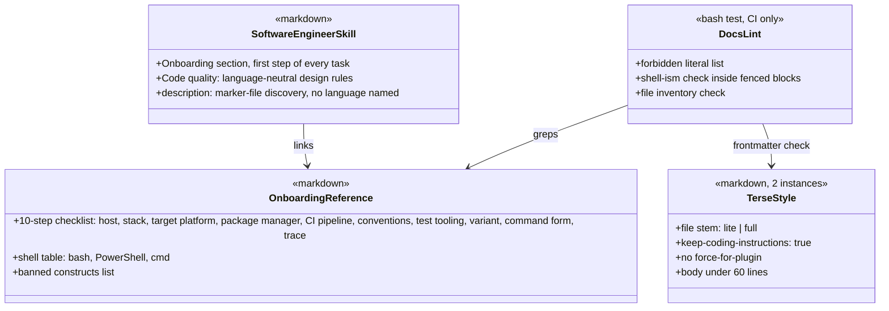

# cross-platform — Tasks

Design: [DESIGN.md](./DESIGN.md)

## Analysis

Build: none (markdown plugin, nothing compiles)
Test: `bash tests/docs.test.sh` — created in task 1, red until task 8; `bash tests/style-bench.sh` — created in task 10, maintainer-run
Lint: `claude plugin validate .` — verified green with one warning (root CLAUDE.md, see below)

### Known-failing tests
| Test | Reason | Action |
|---|---|---|
| `claude plugin validate . --strict` | warns `CLAUDE.md at the plugin root is not loaded as project context`; the file is the plan skill's resume anchor and exists only while this workspace is active | use `claude plugin validate .` (exit 0 with warnings) until Phase 6; delete [CLAUDE.md](../../../CLAUDE.md) at Phase 6 (the repo had none before) and run `--strict` once more |

### Constraints discovered

- `claude plugin validate --strict` and a root [CLAUDE.md](../../../CLAUDE.md) conflict (see above). Phase 6 removes the file, not only the entry.
- `glab api -F key=@file` reads a value from a file; `glab mr update --description-file <file>` exists (glab 1.116.0 help). Nested JSON objects still need `--input`.
- `--jq` on `glab` and `gh` is built in (bundled gojq), not an external `jq` dependency.
- Hook-based terse mode is removed by task 0 (see [ADR output-styles](./adrs/output-styles.md)). A dry run of that removal on 2026-10-06 (reverted, nothing committed) touched 11 files, 22 insertions, 82 deletions, and left the plugin with no executable file.
- Output styles (Claude Code docs): plugin `output-styles/*.md`, frontmatter `name`, `description`, `keep-coding-instructions`, `force-for-plugin`; switch with `/output-style <name>`, stored in `.claude/settings.local.json` or `outputStyle` in `~/.claude/settings.json`; live switch since 2.1.251; no documented programmatic switch. Plugin styles surface as `<plugin>:<file stem>`: the 1.8.0 file [terse.md](../../../output-styles/terse.md) is reported as `ni:terse` in this session.
- The upstream caveman mechanism (hooks plus forced style) does not work at all on the current Claude Code version: this session runs 1.8.0 with the style reported active, yet the injected level has no effect on reply length. Claude Code ships a built-in `Concise` style since 2.1.237; it is the baseline ni must beat (NFR7). `claude -p` has no `--output-style` flag in 2.1.291 (probed: `unknown option`), so the bench sets the style through a scratch project's `.claude/settings.local.json`.
- Install facts (Claude Code docs, 2026-10-07): a plugin install is a full git clone at the marketplace `ref`; no ignore file or exclude field exists; only known component paths are loaded; `git-subdir` and `ref` are the only marketplace-side filters. superpowers ships its whole repo the same way (`.github`, `docs`, `tests`, `scripts`). Decision: keep CI and tests in the repo, delete `docs/` and [CLAUDE.md](../../../CLAUDE.md) in the last PR commit (tasks 12, 13).
- Session 1 note: the per-file test names listed in tasks 3 and 4 (`test_c4_inputs_*`, `test_gitlab_md_*`) are covered by the generic `test_no_platform_leaks` and `test_no_shell_isms` plus grep checks in the task reports; no per-file test was added. Task 6 also fixed a latent bug: `gh api -f body=@body.md` posted the literal string, `-F` reads the file.
- No shell is assumed. Per-shell differences to document: wrapper invocation (`./name` in bash, `name.bat` or `name.cmd` in PowerShell and cmd), environment variables (`$HOME`, `$env:USERPROFILE`, `%USERPROFILE%`), temp dir (`$TMPDIR`, `$env:TEMP`, `%TEMP%`), quoting (single quotes in bash and PowerShell, double quotes in cmd), path separators. Shell-neutral replacements exist for the current bash-isms: `git shortlog -sne --since="6 months ago" -- <paths>` for `git log | sort | uniq -c`; `-F body=@body.md`, `--input payload.json`, `--description-file <file>` for `$(cat <file>)`; files written by Claude with the Write tool for heredocs. `python3` is absent on Windows; `python` is present.

### Inventory: what converts and what does not

Severity from the 2026-10-06 sweep.

| Path | Severity | Platform coupling | Task |
|---|---|---|---|
| `plugin.json` hooks block, `scripts/*.sh`, 1.8.0 terse output style, command, skill | HIGH | bash, `jq`, `python3`, `~/.claude/ni/terse`; `terse-activate.sh` exits 127 without `jq` (probed) | 0 |
| [software-engineer/dotnet.md](../../../skills/software-engineer/dotnet.md), [rust.md](../../../skills/software-engineer/rust.md) | HIGH | one machine's toolchain paths, host-specific binaries, bash functions; deleted, replaced by onboarding | 2 |
| [c4-graph/inputs.md](../../../skills/c4-graph/inputs.md) | HIGH | `/tmp/mm.html`, heredoc, `python3 -c`, Chrome binary unlocated | 3 |
| [code-review/gitlab.md](../../../skills/code-review/gitlab.md) | MED | `python3` heredoc for the DiffNote payload; `$(cat body.md)` | 4, 6 |
| [plan/templates/preflight.md](../../../skills/plan/templates/preflight.md) | HIGH | `grep -rPn` (GNU PCRE), fails on BSD grep | 5 |
| [plan/SKILL.md](../../../skills/plan/SKILL.md), [code-review/github.md](../../../skills/code-review/github.md), [git-conventions/gitlab.md](../../../skills/git-conventions/gitlab.md), [git-conventions/github.md](../../../skills/git-conventions/github.md) | MED | `mkdir -p`, `$(cat <file>)`, `git log ... \| sort \| uniq -c \| sort -rn` | 6 |
| New [lite.md](../../../output-styles/lite.md), [full.md](../../../output-styles/full.md) | NEW | none, markdown only | 7 |
| [commands/help.md](../../../commands/help.md), [review-loop.md](../../../commands/review-loop.md), [merge-loop.md](../../../commands/merge-loop.md), [agents/](../../../agents/builder.md), other skills | NONE | prose | none |
| [README.md](../../../README.md) | MED | Unix paths; no requirements; language rows; no release note | 8 |

### Domain model

### Requirement traceability

| Type / File | Stability | Addresses | Notes |
|---|---|---|---|
| [onboarding.md](../../../skills/software-engineer/onboarding.md) (task 2) | internal | [FR3](./DESIGN.md#fr3), [FR7](./DESIGN.md#fr7) | Linked from six skill files |
| [software-engineer/SKILL.md](../../../skills/software-engineer/SKILL.md) | published | [FR3](./DESIGN.md#fr3) | Section names and description are trigger text; under 150 lines |
| `TerseStyle` × 2 | published | [FR10](./DESIGN.md#fr10) | File stems are what users type after `/output-style ni:`; renaming is breaking |
| `tests/docs.test.sh` | internal | [NFR1](./DESIGN.md#nfr1), [NFR2](./DESIGN.md#nfr2) | Bash, Linux CI only |
| `tests/style-bench.sh` + [prompts.md](../../../tests/style-bench/prompts.md) | internal | [NFR7](./DESIGN.md#nfr7) | Bash, maintainer-run, needs a logged-in Claude Code; result table committed to README |
| ni-bench result tables (README Benchmark section) | published | [NFR8](./DESIGN.md#nfr8) | Tool lives in its own repository; this plan only consumes its output |
| [plugin.json](../../../.claude-plugin/plugin.json) | published | [FR1](./DESIGN.md#fr1), [FR9](./DESIGN.md#fr9) | Version `2.0.0` |

### Transformations

| Function | Input → Output | Invariant / Rule |
|---|---|---|
| `docs.test.sh` | repo tree → `ok`/`FAIL` lines, exit code | Exit 1 on any `FAIL`; each test prints its name |
| `test_no_runtime_files` | `git ls-files` → pass/fail | No `.sh`, `.ps1`, `.cmd`, `.js`, `.py` outside `tests/`; manifest has no `hooks` key |
| `test_no_platform_leaks` | `skills/**/*.md` → pass/fail | No `/mnt/c/`, `.exe`, `grep -P`, `python3`, `/tmp/`, `sudo `, `/usr/bin/env`, `~/`, upstream project name; lines after a `<!-- platform-table -->` marker are exempt |
| `test_no_shell_isms` | fenced blocks in `skills/**/*.md` → pass/fail | Inside fenced blocks no `$(`, `${`, `<<`, `export `, `&&`, `\|\|`, `2>/dev/null`, `\| sort`, `\| uniq`, `\| grep`, `\| awk`, `\| sed`, `\| xargs`; lines after a `<!-- shell-table -->` marker are exempt |
| `test_software_engineer_files` | directory listing → pass/fail | `skills/software-engineer/` holds exactly [SKILL.md](../../../skills/software-engineer/SKILL.md) and [onboarding.md](../../../skills/software-engineer/onboarding.md) |
| `test_onboarding_checklist` | [onboarding.md](../../../skills/software-engineer/onboarding.md) → pass/fail | Ten numbered steps with the headings from the ADR, in order; ≤ 100 lines; a `<!-- shell-table -->` marker present |
| `test_terse_styles_frontmatter` | 2 style files → pass/fail | `keep-coding-instructions: true`; no `force-for-plugin`; body ≤ 60 lines |
| `style-bench.sh` | 10 prompts × 4 styles → markdown table | One scratch project per style with `outputStyle` set; `claude -p --output-format json` per prompt; sums `usage.output_tokens` and visible reply characters; facts checked by a second `claude -p` judge call; exit 1 when `ni:lite` tokens ≥ `concise`, `ni:full` reply chars ≥ `ni:lite`, or a ni style misses a fact; full-vs-lite tokens reported only |
| Onboarding step 8 (variant) | project files + host → toolchain or stop | Never substitute a toolchain the project does not use; a host that cannot run it ends the task with a statement |
| Onboarding step 10 (trace) | commands → final report lines | Every command names its source file |
| Link lint (preflight) | workspace `.md` files → matching lines | Flags a backticked `.md` path not preceded by `[`; same lines as the former `grep -P` on the fixture |

## Tasks

### 0. Remove hook-based terse mode ([FR1](./DESIGN.md#fr1), [FR2](./DESIGN.md#fr2))
**Goal**: Leave the plugin with no executable file and no reference to the hook mechanism.
**Types**: [plugin.json](../../../.claude-plugin/plugin.json)
**Constraints**:
- [ADR output-styles](./adrs/output-styles.md): hooks go, styles come back in task 7
- Delete `scripts/` (3 files), the 1.8.0 terse command, terse output style, and terse skill folder
- `plugin.json`: remove the `hooks` block, the `terse` keyword, and "Terse replies by default" from the description
- README: remove the "Pick a terse level" tour step (renumber the rest), the "Terse mode" section, the `output-styles/` and `scripts/` layout rows, the `ni:terse` skill row, the `/ni:terse` command row, and the upstream mentions
- Agents: "Terse full." opener becomes "Compressed output." in builder, investigator, reviewer
- Skills: drop "whatever the terse level" in debug (2 places), "lite terse" in software-engineer and skill, the hook sentence and `scripts/*.sh` layout line in skill, the "Adapted from" lines in code-review and git-conventions
- [NOTICE](../../../NOTICE): drop the terse skill and hooks from the attribution sentence; keep code-review, git-conventions, and agents
**Tests**: none automated yet (task 1 adds `test_no_runtime_files`, green after this task)
**Verify**: `git ls-files | grep -cE '\.(sh|ps1|cmd|js|py)$' | grep -qx 0 && grep -c '"hooks"' .claude-plugin/plugin.json | grep -qx 0 && claude plugin validate .`
**Acceptance criteria**:
- [x] Verify command exits 0
- [x] `grep -rniI 'terse\|hook' --exclude-dir=.git --exclude-dir=docs .` returns only the investigator example rows and the NOTICE URL
- [x] Commit `refac!: remove hook-based terse mode` with the BREAKING CHANGE footer from [PREFLIGHT.md](./PREFLIGHT.md)
**Depends on**: (none)
**Time-box**: ~30 min
**Uncertainty**: downhill

### 1. Docs lint harness ([NFR1](./DESIGN.md#nfr1), [NFR2](./DESIGN.md#nfr2))
**Goal**: Create the lint every content task extends.
**Types**: `tests/docs.test.sh`
**Constraints**:
- Bash, runs on the Linux CI leg only; no tool beyond `git`, `grep`, `sed`, `awk`, `wc`
- Assertions print `ok <name>` or `FAIL <name>`, exit 1 on any failure
- Forbidden literal lists are arrays at the top of the file
**Tests**:
- `test_no_runtime_files` — green after task 0
- `test_manifest_has_no_hooks` — green after task 0
- `test_no_platform_leaks` — red now
- `test_no_shell_isms` — red now
- `test_software_engineer_files` — red now (two language files present, no onboarding file)
- `test_onboarding_checklist` — red now
- `test_terse_styles_frontmatter` — red now
**Verify**: `bash tests/docs.test.sh; test $? -eq 1`
**Acceptance criteria**:
- [x] First two tests green, five red naming the offending or missing files
**Depends on**: task 0
**Time-box**: ~45 min
**Uncertainty**: downhill

### 2. Onboarding reference and software-engineer rewrite ([FR3](./DESIGN.md#fr3), [FR7](./DESIGN.md#fr7))
**Goal**: Replace the two language files with one onboarding reference and make it the first step of every task.
**Types**: [onboarding.md](../../../skills/software-engineer/onboarding.md), [software-engineer/SKILL.md](../../../skills/software-engineer/SKILL.md)
**Constraints**:
- [ADR project-onboarding](./adrs/project-onboarding.md): the ten-step checklist in order, each step with sources to read and what to extract; the shell table (bash, PowerShell, cmd) with a `<!-- shell-table -->` marker; the banned constructs list from [FR7](./DESIGN.md#fr7); ≤ 100 lines
- Delete [dotnet.md](../../../skills/software-engineer/dotnet.md) and [rust.md](../../../skills/software-engineer/rust.md)
- SKILL.md: `## Stack` becomes `## Onboarding` (three to five lines, links the reference, states it runs once per project per session and before any build command); `## Workflow` step 4 and `## Testing strategy` stop saying "stack file" and say "the commands found during onboarding"; `## Code quality` gains the language-neutral design rules (absence and failure as values, small named types for domain values, no sentinel values); the "Cobertura" sentence becomes "the machine-readable format the toolchain emits natively"
- Description rewritten under 1024 characters: triggers on build, test, lint, format, coverage requests on any project, on onboarding or taking over an existing codebase, on reading a CI pipeline to find the build commands; names no language
- SKILL.md under 150 lines; no language or toolchain named anywhere in the two files
**Tests**: `test_software_engineer_files`, `test_onboarding_checklist`, `test_no_shell_isms` for these files
**Verify**: `bash tests/docs.test.sh && claude plugin validate .`
**Acceptance criteria**:
- [x] Three tests green
- [ ] Moved to task 9: this repo has no CI file before task 8, so the haiku probe (`claude --plugin-dir . --model haiku -p "how do I run the tests of this repo"`) answered from TASKS.md and could not show the CI pass; verified instead on a sample project with a CI file in task 9
**Depends on**: task 1
**Time-box**: ~60 min
**Uncertainty**: downhill

### 3. c4-graph inputs.md portable render ([FR4](./DESIGN.md#fr4), [NFR2](./DESIGN.md#nfr2))
**Goal**: Remove `/tmp`, the heredoc, `python3`, and the unlocated Chrome binary from the render recipe.
**Types**: none
**Constraints**:
- No heredoc: Claude writes the HTML file with the Write tool into the working directory (`mm.html`), the render command reads it by relative path, the PNG lands beside it; both files are deleted after viewing
- Chrome table: Linux `google-chrome` or `chromium`; macOS `/Applications/Google Chrome.app/Contents/MacOS/Google Chrome`; Windows `C:\Program Files\Google\Chrome\Application\chrome.exe`; WSL `/mnt/c/Program Files/Google/Chrome/Application/chrome.exe` (rows exempt from the leak test by a `<!-- platform-table -->` marker on the line above)
- `file://` URI built from the absolute path of `mm.html`, printed by Claude, not computed by the shell
- URL-decode step: `python -c` or `node -e` when present, else "paste the model and ask Claude to decode it"
- One link to the onboarding reference
**Tests** (in `tests/docs.test.sh`):
- `test_c4_inputs_no_hardcoded_tmp`
- `test_c4_inputs_chrome_table_four_rows`
**Verify**: `bash tests/docs.test.sh`
**Acceptance criteria**:
- [x] Two tests green
- [x] Render recipe still under 15 lines
**Depends on**: task 2
**Time-box**: ~40 min
**Uncertainty**: downhill

### 4. gitlab.md payload without python3 ([FR5](./DESIGN.md#fr5), [NFR2](./DESIGN.md#nfr2))
**Goal**: Build the `DiffNote` payload with no interpreter.
**Types**: none
**Constraints**:
- Replace the `python3 - "$(cat body.md)"` heredoc with: write `payload.json` directly (Write tool, body JSON-escaped), then `glab api --method POST ... --input payload.json` unchanged
- Flat string fields use `-F body=@body.md`
- Note that `--jq` is built into `glab` and `gh`, no external `jq`
- Keep the `DiffNote` vs `DiscussionNote` verification paragraph
**Tests** (in `tests/docs.test.sh`):
- `test_gitlab_md_no_python3`
- `test_gitlab_md_keeps_input_payload`
**Verify**: `bash tests/docs.test.sh`
**Acceptance criteria**:
- [x] Two tests green
- [x] File length not increased by more than 5 lines
**Depends on**: task 1
**Time-box**: ~30 min
**Uncertainty**: downhill

### 5. Portable link lint in preflight.md ([FR6](./DESIGN.md#fr6))
**Goal**: Replace the GNU-only `grep -rPn` with `git grep -nE`.
**Types**: none
**Constraints**:
- New command: `git grep -nE '(^|[^[])`([[:alnum:]._-]+/)*[[:alnum:]._-]+\.md(:[0-9]+([-,:][0-9]+)?)?`' -- 'docs/workspace/<NAME>/*.md'`; single quotes work in bash and PowerShell, a cmd line with double quotes sits beside it
- Must flag the same lines as the old command on a fixture; the test compares both on Linux
- Add one sentence: run from the repository root
- Update the lint line in this workspace's [PREFLIGHT.md](./PREFLIGHT.md) too
**Tests** (in `tests/docs.test.sh`):
- `test_preflight_lint_is_git_grep`
- `test_preflight_lint_matches_pcre_on_fixture`
**Verify**: `bash tests/docs.test.sh`
**Acceptance criteria**:
- [x] Two tests green
- [x] New lint on `docs/workspace/cross-platform` returns no hit
**Depends on**: task 1
**Time-box**: ~30 min
**Uncertainty**: downhill

### 6. Shell-neutral commands and onboarding links in the other skills ([FR7](./DESIGN.md#fr7))
**Goal**: Every skill file with command blocks is shell-neutral and links to the onboarding reference once.
**Types**: none
**Constraints**:
- [git-conventions/gitlab.md](../../../skills/git-conventions/gitlab.md): `git log --since="6 months ago" --format=%ae -- <paths> | sort | uniq -c | sort -rn` becomes `git shortlog -sne --since="6 months ago" -- <paths>`; `glab mr update <iid> --description "$(cat <file>)"` becomes a Write of the file plus `glab mr update <iid> --description-file <file>` (flag verified in glab 1.116.0)
- [code-review/github.md](../../../skills/code-review/github.md): same `git shortlog` replacement; `gh` calls that read a body use `-F body=@<file>`
- [code-review/gitlab.md](../../../skills/code-review/gitlab.md): the `-m "$(cat body.md)"` forms become `glab api ... -F body=@body.md` (task 4 covers the DiffNote payload)
- [plan/SKILL.md](../../../skills/plan/SKILL.md): the `mkdir -p` line states that Claude creates the folders with the Write tool, no shell command
- One link each from the four files above plus [git-conventions/github.md](../../../skills/git-conventions/github.md) and [c4-graph/inputs.md](../../../skills/c4-graph/inputs.md) to the onboarding reference, per the skill linking rule (sibling skills link to [software-engineer/SKILL.md](../../../skills/software-engineer/SKILL.md), which links the reference)
**Tests** (in `tests/docs.test.sh`):
- `test_six_files_link_onboarding`
- `test_no_shell_isms` green for these files
**Verify**: `bash tests/docs.test.sh`
**Acceptance criteria**:
- [x] Both tests green
- [x] `grep -c "description-file" skills/git-conventions/gitlab.md` prints at least 1
**Depends on**: tasks 2, 3, 4, 5
**Time-box**: ~45 min
**Uncertainty**: downhill

### 7. Terse output styles ([FR10](./DESIGN.md#fr10), [NFR6](./DESIGN.md#nfr6))
**Goal**: Ship `ni:lite` and `ni:full` as plugin output styles and confirm their picker names.
**Types**: `TerseStyle` × 2
**Constraints**:
- [ADR output-styles](./adrs/output-styles.md): files [lite.md](../../../output-styles/lite.md) and [full.md](../../../output-styles/full.md); frontmatter `description` one sentence, `keep-coding-instructions: true`, no `name` (the file stem is the name), no `force-for-plugin`
- Bodies written fresh for ni, no upstream wording; [NOTICE](../../../NOTICE) unchanged
- lite body: drop filler, pleasantries, hedging, openers, closing summaries, offers of help, tool-call narration; full sentences under 20 words; one idea per sentence; imperative for instructions; technical terms, code, commands, and error strings exact; never drop not, never, no, only, except; persisted text (docs, MR or PR text, issues, comments, commit messages) stays in short full sentences; plain prose for security warnings and irreversible actions
- full body: lite rules plus drop articles, fragments allowed, shortest synonym, no fake broken grammar, no invented abbreviations, no arrows as connectors; persisted text still follows lite
- Each body ≤ 60 lines; `## Rules`, `## Persisted text`, `## Plain prose exceptions` headings
- Picker name verification: run `claude --plugin-dir .`, open `/output-style`, record both names here
**Tests**: `test_terse_styles_frontmatter`
**Verify**: `bash tests/docs.test.sh && claude plugin validate .`
**Acceptance criteria**:
- [x] Test green (`ok test_terse_styles_frontmatter`; `claude plugin validate .` exit 0 with the known root CLAUDE.md warning)
- [ ] Picker names recorded here: lite = `ni:lite`, full = `ni:full` (expected from the `ni:terse` precedent; headless load confirmed with `claude --plugin-dir . -p "Reply with the single word pong"` → `pong`) — pending maintainer picker check
- [x] Run 6: `ni:full` P1 513 chars / 82 words versus `ni:lite` P1 946 chars / 157 words; the article check was observed on the same prompt in the task 7 headless run (zero articles)
**Headless effect check (2026-10-07)**: scratch dir outside the repo, `.claude/settings.local.json` = `{"outputStyle":"ni:full"}`, prompt `Explain database connection pooling in one short paragraph`, `claude --plugin-dir <repo> -p ... --output-format json`. The setting is honoured: the two replies differ in form.
- `ni:full`, `usage.output_tokens` 207, 84 words, zero articles: "Connection pool keeps set of open database connections ready for reuse instead of opening new one per request. Opening connection costs TCP handshake, TLS, authentication, session setup, often tens of milliseconds. Application borrows connection from pool, runs queries, returns it. Pool enforces max size, caps concurrent connections so database not overwhelmed. Idle timeout and health checks drop stale connections. Typical settings: min idle, max size, acquire timeout, max lifetime. Examples: HikariCP (Java), PgBouncer (server-side for PostgreSQL), connection pooling built into most ORMs and drivers."
- `default`, `usage.output_tokens` 196, 93 words: "Database connection pooling keeps a set of open database connections ready for reuse instead of opening a new one for every request. Opening a connection is expensive, since it involves a TCP handshake, authentication, and session setup, so an application borrows a connection from the pool, runs its queries, and returns it. The pool caps the number of concurrent connections, which protects the database from overload, and it typically handles health checks, idle timeouts, and reconnection. Common implementations include HikariCP for Java, pgbouncer for PostgreSQL, and the built-in pooling in ADO.NET and SQLAlchemy."
- Reading: `ni:full` drops articles and fragments as specified, but adds facts (TLS, settings list) and spends more output tokens (207 vs 196) on the "one short paragraph" prompt. The 40-word target needs the shorter prompt from NFR6 ("explain connection pooling") or a tighter length rule in the body; task 10's benchmark decides the rewrite.
**Depends on**: task 1
**Time-box**: ~45 min
**Uncertainty**: downhill

### 10. Style benchmark against Concise ([NFR7](./DESIGN.md#nfr7))

**Run 5 (2026-10-07, amended NFR7, sonnet replies, haiku judge)**: default 5247 tokens / 9753 chars / 36/36; concise 5224 / 9770 / 36/36; ni:lite 3384 / 4642 / 35/36; ni:full 3252 / 3647 / 36/36. Tokens and chars thresholds pass; ni:lite P4 (TLS handshake) dropped "completes before any application data is sent". Fix: lite.md budget gains "name the concepts first, then the mechanism, never a step dropped" (same wording as full.md). Run 6 follows.
**Goal**: Prove `ni:lite` and `ni:full` beat the built-in `Concise` style, or fix them until they do.
**Types**: `tests/style-bench.sh`, [prompts.md](../../../tests/style-bench/prompts.md)
**Constraints**:
- [ADR output-styles](./adrs/output-styles.md) benchmark paragraph: 10 prompts, 4 styles, output tokens plus fact checklist
- [prompts.md](../../../tests/style-bench/prompts.md): each prompt with its list of technical facts a correct reply must contain (3 to 6 facts); 5 explanation prompts, 5 code-change prompts against a small sample repo created by the script in a scratch directory
- The script creates one scratch project per style with `.claude/settings.local.json` holding `outputStyle`, runs `claude --plugin-dir <repo> -p "<prompt>" --output-format json`, sums `usage.output_tokens`, then asks a judge call (`claude -p`, default style) to answer yes or no per fact; prints a markdown table (style, total output tokens, facts kept) and exits 1 on the NFR7 thresholds
- Bash, maintainer-run, not in CI; documented in the README Develop section
- If a ni style fails, edit its body in task 7's files and rerun; record each iteration's table in this task
**Tests**: the bench is the test
**Verify**: `bash tests/style-bench.sh` exits 0
**Acceptance criteria**:
- [x] Run 6 (2026-10-07, sonnet replies, haiku judge, Claude Code 2.1.292, exit 0): default 4911 tokens / 9175 chars / 36/36; concise 5286 / 10146 / 36/36; ni:lite 3374 / 5618 / 36/36; ni:full 3271 / 3445 / 36/36. ni:lite 36% under concise on tokens; ni:full 39% under ni:lite on visible chars and 3% under on tokens. Thresholds met (amended NFR7)
- Run 7, confirmation with `MAX_THINKING_TOKENS=0` (informational): default 5301 tokens / 9553 chars; concise 5202 / 9440; ni:lite 3414 / 4381 / 35/36; ni:full 3701 / 3642 / 36/36. Output tokens barely moved with thinking off, so the full-versus-lite token gap is tool-call tokens on the change prompts, not thinking. The one ni:lite miss (P2 "GET, PUT, and DELETE are idempotent") is a judge false negative: the kept reply states "GET, HEAD, OPTIONS, PUT, and DELETE are idempotent by specification" and the judge comment itself says so. `tests/style-bench/last-run.md` holds run 7; the README publishes run 6 (gated, green).
- [ ] [ADR output-styles](./adrs/output-styles.md) status moves to `accepted` only after this box is ticked
**Bench runs (2026-10-07, replies sonnet, judge haiku, Claude Code 2.1.292)**:
- Red before any style change (one prompt, P1, unchanged bodies): `concise` 721 tokens / 328 words, `ni:full` 676 tokens / 269 words, both 4/4 facts. Word diet without a scope: 7% fewer tokens only.
- Iteration 1: `## Scope` section added to both bodies (answer only what was asked, sentence budget, stop when answered; full adds "fragments on top of the budget, never instead of it"). Exit 1.

  | style | output tokens | facts kept | words |
  |---|---|---|---|
  | default | 4840 | 31/36 (86%) | 1527 |
  | concise | 5130 | 34/36 (94%) | 1510 |
  | ni:lite | 3516 | 36/36 (100%) | 759 |
  | ni:full | 3198 | 26/36 (72%) | 556 |

  Reading: tokens green (`concise` ≥ `default` here, not a threshold). `ni:full` red on facts: 3 of the 10 misses were judge failures (haiku answered the instructions instead of grading, 0/n counted), 2 were facts about verification wording in P6 and P10 that no style stated, 2 were real budget drops (P1 borrow and return, P4 handshake before data). Fixes before iteration 2: judge prompt reworded as a grading task with the reply between markers plus one retry; P6 fact 4 and P10 fact 3 rephrased to the edit itself; full.md explanation budget loosened to "four or five sentences, one fact each, cut words never a step of the mechanism". lite.md unchanged.
- Iteration 2: judge fix plus the loosened full.md budget. Exit 1.

  | style | output tokens | facts kept | words |
  |---|---|---|---|
  | default | 5301 | 36/36 (100%) | 1512 |
  | concise | 5103 | 36/36 (100%) | 1535 |
  | ni:lite | 3365 | 36/36 (100%) | 756 |
  | ni:full | 3475 | 36/36 (100%) | 656 |

  Reading: facts 100% everywhere, judge stable. `ni:full` lost to `ni:lite` on tokens by 110: the five-sentence budget invited adjacent content (P1 grew a settings list, P2 examples), and the change prompts (P6 to P10, 2300 to 2500 tokens per style) are dominated by tool-call tokens that swing ±200 between runs. Fix before iteration 3: full.md budget tightened to "a question gets one or two sentences; an explanation gets at most three sentences, two facts in one sentence when needed, never a step of the mechanism dropped". lite.md unchanged.
- Iteration 3: three-sentence full.md budget. Exit 1.

  | style | output tokens | facts kept | words |
  |---|---|---|---|
  | default | 5143 | 36/36 (100%) | 1527 |
  | concise | 5259 | 36/36 (100%) | 1579 |
  | ni:lite | 3709 | 36/36 (100%) | 676 |
  | ni:full | 2951 | 35/36 (97%) | 515 |

  Reading: tokens green with a 758 margin between `ni:full` and `ni:lite`. One fact lost: `ni:full` P3 never named the three CAP properties (it jumped to the trade-off). P1 also leaked a settings list as bullets, which the sentence budget did not count. Fix before iteration 4: full.md explanation budget loosened to "at most four sentences, bullets count as sentences: name the concepts first, then the mechanism, never a step dropped". lite.md unchanged.
- Iteration 4 (last allowed, committed state of the bodies). Exit 1.

  | style | output tokens | facts kept | words |
  |---|---|---|---|
  | default | 5227 | 36/36 (100%) | 1486 |
  | concise | 5124 | 36/36 (100%) | 1515 |
  | ni:lite | 3298 | 36/36 (100%) | 757 |
  | ni:full | 3445 | 36/36 (100%) | 587 |

  Reading: facts 100% everywhere; `ni:lite` beats `concise` by 36% in every run; `ni:full` writes 22% fewer words than `ni:lite` but loses on `usage.output_tokens` by 147. Single-turn explain replies show up to 4.5 output tokens per word (`ni:full` P2: 400 tokens, 88 words), so `usage.output_tokens` counts more than the visible text (thinking or tool-call tokens), and the change prompts swing ±200 per run on tool calls. Not green; styles committed as is. Next steps for the maintainer: run the bench with thinking off (`MAX_THINKING_TOKENS=0`) or measure the `result` text, and decide whether the `ni:full` < `ni:lite` threshold should read on text tokens rather than total output tokens.
**Depends on**: task 7
**Time-box**: ~90 min
**Uncertainty**: downhill

### 11. ni-bench comparison 1.8.0 versus 2.0.0 ([NFR8](./DESIGN.md#nfr8))
**Goal**: Prove the 2.0.0 candidate does not regress against 1.8.0 on the published ni-bench suites.
**Types**: none (results tables)
**Constraints**:
- Tool: [ni-bench](https://github.com/itsaspacestation/ni-bench); suites `ported-build` and `ported-debug` as already reported in the README
- Run A: ni 1.8.0 from the marketplace cache (hooks and forced style active). Run B: this working tree with `claude --plugin-dir` and `outputStyle` set to `ni:lite` in the bench project's `.claude/settings.local.json`. Same model, same day, same ni-bench commit
- Record both tables with the ni-bench commit SHA, model id, and date in this task; the README Benchmark section gets a "1.8.0 vs 2.0.0" table next to the existing one (task 8)
- Threshold from NFR8: every KPI equal or better within 5%, outcome 3/3. A regression is analysed with the `debug` skill before any change; a style body change sends task 10 back to red
**Tests**: the two bench runs are the test
**Verify**: `manual: ni-bench run by a maintainer`
**Acceptance criteria**:
- [ ] Both tables pasted here with ni-bench SHA, model id, date
- [ ] Every KPI within the NFR8 threshold, or the regression explained and fixed with a rerun pasted below
**Depends on**: tasks 2, 7, 10
**Time-box**: ~60 min (plus bench wall-clock)
**Uncertainty**: downhill

### 8. README, three-OS CI, and version 2.0.0 ([FR8](./DESIGN.md#fr8), [FR9](./DESIGN.md#fr9), [NFR3](./DESIGN.md#nfr3), [NFR4](./DESIGN.md#nfr4))
**Goal**: Tell users what each platform needs and how terse works now, validate the plugin on three OSes in CI, ship the version bump.
**Types**: none
**Constraints**:
- `## Requirements` before `## Install`: Claude Code's own system requirements per OS (link), 2.1.251 or later for live style switching, `glab` or `gh` per forge, Chrome for c4 PNG only; one sentence: ni ships no scripts and assumes no shell
- Skills table: the `ni:software-engineer` row says "any project that already builds; commands discovered from the project (CI pipeline, wrappers, lock files)"; no language named
- `## Reply styles` section: `/output-style ni:lite`, `/output-style ni:full`, `/output-style default`, with the names recorded in task 7; project versus user scope of `outputStyle`
- Agent homes line: add `%USERPROFILE%\.copilot`, `.cursor`, `.gemini`
- Release section: two lines, "2.0.0 drops the caveman-derived terse hooks, which do not work on current Claude Code, for ni's own output styles: run `/output-style ni:lite` or `ni:full`; `~/.claude/ni/terse` may be deleted" and "language files replaced by project onboarding"
- Benchmark section: add the NFR7 table from task 10 (`default`, `concise`, `ni:lite`, `ni:full`: output tokens, facts kept) and the NFR8 "1.8.0 vs 2.0.0" tables from task 11 next to the existing benchmark table; Develop section documents `bash tests/style-bench.sh` and the manual ni-bench procedure
- `.github/workflows/test.yml`: one job, `strategy.matrix.os: [ubuntu-latest, windows-latest, macos-latest]`, `fail-fast: false`; steps: `actions/checkout`, `actions/setup-node` (LTS), `npx @anthropic-ai/claude-code plugin validate .` on every leg (no PATH dependency, see failure modes), `bash tests/docs.test.sh` with `if: runner.os == 'Linux'`; workflow `shell: bash` default is not set, each step uses the runner default shell so the validate step itself proves shell neutrality; badge in README; branch protection on `main` requires all three legs
- [plugin.json](../../../.claude-plugin/plugin.json): `version` `2.0.0`; description drops ".NET and Rust builds" for "build, test, and coverage on any project"; keywords drop `dotnet`, `rust`, add `output-style`, `onboarding`, `windows`, `macos`, `cross-platform`
**Tests** (in `tests/docs.test.sh`):
- `test_readme_has_requirements_section`
- `test_readme_reply_styles_section` — the three `/output-style` commands present
- `test_readme_release_notes_migration`
- `test_readme_names_no_language` — no `dotnet`, `rust`, `.NET`, `Rust`, `Cargo` in README
- `test_plugin_version_is_2_0_0`
**Verify**: `bash tests/docs.test.sh && claude plugin validate .`; then push and `gh run watch` shows three legs green (needs `gh auth login` first)
**Acceptance criteria**:
- [ ] Five tests green
- [ ] Workflow green on ubuntu, windows, and macos on the feature branch; badge visible
- [ ] Windows and macos legs run `plugin validate` in the runner default shell (PowerShell, zsh), no `shell: bash` override
**Depends on**: tasks 6, 7, 10, 11
**Time-box**: ~45 min
**Uncertainty**: downhill

### 12. Shipped-tree lint ([NFR9](./DESIGN.md#nfr9))
**Goal**: Fail CI when the repository grows outside the Claude Code plugin structure, over budget, or with a secret.
**Types**: `tests/docs.test.sh`
**Constraints**:
- New test `test_shipped_tree`, in the file's style, bash 3.2: (a) top-level entries of `git ls-files` ⊆ allowlist `.claude-plugin agents commands skills output-styles assets README.md LICENSE NOTICE .github tests`, plus `docs` and [CLAUDE.md](../../../CLAUDE.md) only when `git branch --show-current` is not `main` (in GitHub Actions use `GITHUB_REF_NAME` when set); (b) `git grep -lE -- '-----BEGIN|ghp_[A-Za-z0-9]{20}|glpat-|AKIA[0-9A-Z]{16}'` returns nothing; (c) total size of tracked files under 1024 KB (`git ls-files -z` into `du -ck`, or `wc -c` summed)
- README Layout section gains one sentence: an install is a full clone; `.github/` and `tests/` ship but are never loaded; `docs/` and [CLAUDE.md](../../../CLAUDE.md) exist only on pull requests
**Tests**: `test_shipped_tree`
**Verify**: `bash tests/docs.test.sh`
**Acceptance criteria**:
- [x] Test green on this branch (docs tolerated) and red when simulated with `GITHUB_REF_NAME=main` while `docs/` exists
- [x] README sentence present
**Depends on**: task 1
**Time-box**: ~30 min
**Uncertainty**: downhill

### 13. Close the pull request: delete workspace docs ([NFR9](./DESIGN.md#nfr9), [NFR3](./DESIGN.md#nfr3))
**Goal**: Leave `main` with the plugin, CI, and tests only; history keeps the plan.
**Types**: none
**Constraints**:
- Last commit of the PR, after every other task is ticked and the Windows smoke test is recorded: `git rm -r docs CLAUDE.md`
- Commit message `docs(cross-platform): remove workspace, plan kept in history` with a body naming the plan commit SHA and the session checkpoint SHAs
- `claude plugin validate . --strict` exit 0 (no root CLAUDE.md, so no warning), `bash tests/docs.test.sh` green with `GITHUB_REF_NAME=main`
- This replaces the plan skill's Phase 6 promotion step for this workspace
**Tests**: `test_shipped_tree` under `GITHUB_REF_NAME=main`
**Verify**: `GITHUB_REF_NAME=main bash tests/docs.test.sh` exit 0 and `claude plugin validate . --strict` exit 0
**Acceptance criteria**:
- [ ] Both verify commands exit 0
- [ ] `git ls-files | cut -d/ -f1 | sort -u` prints exactly the NFR9 allowlist
**Depends on**: tasks 8, 9
**Time-box**: ~15 min
**Uncertainty**: downhill

### 9. Native Windows smoke test ([NFR5](./DESIGN.md#nfr5))
**Goal**: Observe the plugin working once on a Windows host without WSL.
**Types**: none
**Constraints**:
- Windows host with Claude Code installed; `claude --plugin-dir <checkout>`
- Record the observations in this file under the task
**Tests**: manual, see NFR5
**Verify**: `manual: Windows host session`
**Acceptance criteria**:
- [ ] `/ni:help` lists the skills
- [ ] On a sample project with a CI file, "run the tests" shows the onboarding pass (CI file read, wrapper chosen) and the command runs in the host's shell form; this also closes task 2's moved criterion
- [ ] `/output-style` lists `ni:lite` and `ni:full`
**Depends on**: task 8
**Time-box**: ~30 min
**Uncertainty**: downhill

## Sessions

### Session 1 — Removal, lint, onboarding, portability (~4H)
Tasks: 0, 1, 2, 3, 4, 5, 6
**Skills**: `skill`, `software-engineer`, `tdd`, `evidence-based-analysis`
**Checkpoint**: `bash tests/docs.test.sh 2>&1 | grep -c '^FAIL' | grep -qx 1 && claude plugin validate .` (only `test_terse_styles_frontmatter` stays red)
**Commit point**: yes, `refac!: ...` for task 0, then `test(docs): ...`, `docs(skills): ...` per task

### Session 2 — Styles, benchmarks, shipped-tree lint, release (~4.5H)
Tasks: 7, 10, 11, 12, 8
**Skills**: `skill`, `git-conventions`
**Checkpoint**: `bash tests/docs.test.sh && claude plugin validate . && git grep -nE '(^|[^[])`([[:alnum:]._-]+/)*[[:alnum:]._-]+\.md' -- 'docs/workspace/cross-platform/*.md' ; test $? -eq 1`
**Commit point**: yes, `feat(styles): ni:lite and ni:full output styles`, `test(styles): benchmark against concise`, `docs(benchmark): ni-bench 1.8.0 vs 2.0.0`, `docs(readme): ...`, `ci: ...`, `chore(release): 2.0.0`

### Session 3 — Windows verification and PR close (~0.75H, human)
Tasks: 9, 13
**Skills**: `evidence-based-analysis`
**Checkpoint**: manual observations recorded in task 9
**Commit point**: yes, `docs(workspace): record windows smoke test`

## Quality gates (post-session review)
- [ ] Acceptance criteria: all green above
- [ ] Code review: implementation matches [DESIGN.md](./DESIGN.md) intent
- [ ] Code organization: tests in `tests/`, workflow in `.github/`, no other new top-level folder
- [ ] Code quality: one owner for shell rules; no language named in skills or README
- [ ] Security review: the plugin executes nothing; N/A
- [ ] Observability: CI badge on README, workflow required on `main`
- [ ] Performance: N/A, no runtime
