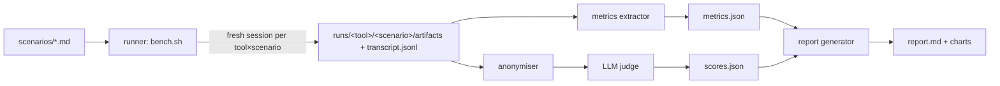
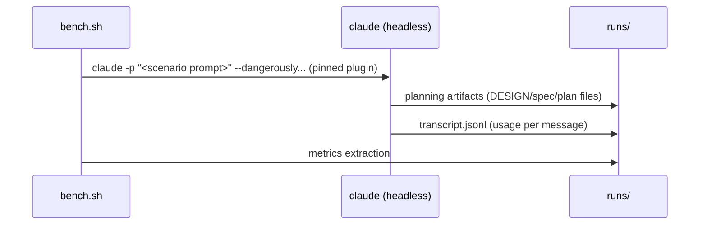

# ni-benchmark — Design Doc

## Context

The ni plugin claims token-efficient, autopilot-ready planning. No evidence backs the claim against alternatives. This benchmark compares three planning workflows on identical tasks:

- **ni** (`ni:plan` + related skills) — this repo
- **superpowers** (obra/superpowers) — brainstorming, writing-plans, executing-plans skills
- **OpenSpec** (Fission-AI/OpenSpec) — spec-driven change proposals via CLI

The output is a reproducible harness plus a comparison report.

## Functional Requirements

### FR1 — Reference scenarios
Define 2–3 fixed planning scenarios of increasing complexity (e.g. small CLI feature, API endpoint with persistence, cross-cutting refactor). Each scenario is a single prompt file, identical for all three tools.

**Prompt realism rule**: the prompt is written as a developer would naturally ask ("I want to add X — help me plan it before implementing"). It never enumerates deliverables, formats, or artifact types (no "produce diagrams", "write requirements", "create a spec"). What each workflow produces unprompted is the measurement.

### FR2 — Run protocol
For each (tool, scenario) pair: fresh Claude Code session, pinned plugin/tool versions, same model, scripted invocation. Capture: all generated planning artifacts, full session transcript (JSONL), wall-clock time.

### FR3 — Objective metrics extraction
A script computes, per run, from transcripts and artifacts:
- **Tokens**: input, output, cache read/write (from transcript JSONL usage fields)
- **Context overhead**: tokens injected by the plugin's skills/hooks at load
- **Verbosity**: artifact word count, information density (requirements per 100 words)
- **Diagrams**: Mermaid block count, types used (class, sequence, flowchart), render validity (`mmdc` exit 0). Descriptive metric only — reported in its own KPI column, never fed to the quality rubric (see FR4), so tools without native diagrams are not double-penalised
- **Turns**: number of human interventions required to finish planning

### FR4 — Quality rubric scoring
A blinded LLM judge scores each artifact set on a fixed rubric (1–5 per dimension):
- Requirements completeness (FR/NFR present, measurable)
- System design coverage (architecture, failure modes, trust boundaries, data/migration, rollback)
- Traceability (requirements ↔ design ↔ tasks linkage)
- Task executability (acceptance criteria pass/fail, verify commands, dependencies declared)
- Decision capture (ADRs or equivalent, alternatives recorded)
Artifacts are anonymised (tool names stripped) before judging. Human spot-checks 20% of scores.

The judge instruction states explicitly: score the *substance* of each dimension regardless of representation — prose, table, or diagram all count equally. Diagram presence is measured in FR3, not here.

### FR5 — Comparison report
One report: KPI matrix (tool × metric), charts (token cost, quality scores), qualitative findings, and a methodology section. Lives in `docs/` after integration.

## Non-Functional Requirements

### NFR1 — Reproducibility
- **Scenario**: anyone re-runs the harness with pinned versions → metrics within ±10% on objective KPIs
- **Measure**: two consecutive runs of one (tool, scenario) pair differ < 10% on token totals
- **Verify**: `scripts/bench.sh --repeat 2 --check-variance` exits 0

### NFR2 — Fairness
- **Scenario**: identical prompt, model, and permissions per run; judge never sees tool identity
- **Measure**: blinding check finds no tool name in judged artifacts
- **Verify**: `grep -riE 'superpowers|openspec|ni:' judged/ ; test $? -eq 1`

### NFR3 — Cost cap
- **Scenario**: full benchmark run (3 tools × 3 scenarios + judging)
- **Measure**: total ≤ 15M tokens
- **Verify**: `manual: sum of run token totals from metrics.json`

## Non-goals

- **Execution/autopilot comparison** — running the produced plans to completion. Deferred: multiplies cost ~5×; plan executability is proxied by the rubric (FR4). Revisit as v2.
- **Trigger accuracy of skills** — covered by `claude plugin eval` tooling, separate concern.
- **General coding-quality benchmark** — only the planning phase is compared.

## Rabbit holes

- **Judge prompt tuning** — cap at one calibration pass against human scores on scenario 1; no iterative prompt optimisation.
- **OpenSpec/superpowers configuration depth** — use each tool's documented default workflow; no per-tool tuning beyond install instructions.
- **Perfect token attribution** — cache tokens complicate cost; report the four raw usage numbers, do not build a cost model.

## Failure modes

| Failure | Detection | Response | Blast radius |
|---|---|---|---|
| Judge scores drift between runs | same artifact scored twice differs > 1 point | score each artifact 3×, take median | one rubric dimension |
| Tool version drift | version not in lockfile at run start | run aborts before any session | whole run |
| Mermaid render fails | `mmdc` non-zero exit | count as invalid diagram, do not fail run | one metric |
| Session hangs/never completes | wall-clock > 30 min | kill, mark run DNF, record partial tokens | one (tool, scenario) run |
| Blinding leak (tool name in artifact) | NFR2 grep | re-anonymise, re-judge that artifact | one judgment |

## Design

No trust boundaries crossed: all local, one operator, judge calls go to the same Claude API already in use. STRIDE: `N/A: single-user local tooling, no untrusted input`.

Sequence per run:

Decisions (ADRs to draft):
- [Judge model and blinding protocol](./adrs/judge-protocol.md)
- [Scenario selection](./adrs/scenario-selection.md)
- [Token measurement source](./adrs/token-measurement.md)

## Data & migration

`N/A: file-based outputs only (runs/, metrics.json, report.md); no persistence layer.`

## Cross-cutting Concerns

- **Observability**: each run writes a `run-meta.json` (versions, model, timestamps, exit status).
- **Rollout/rollback**: `N/A: benchmark harness, not a deployed system.`
