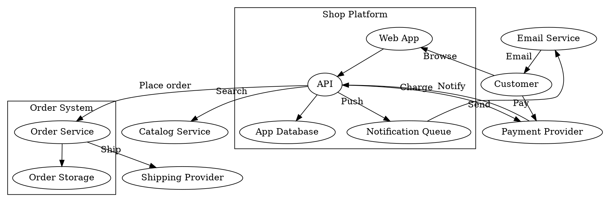

# Inputs and validation

Reference file of the [`c4-graph`](SKILL.md) skill. Read it when converting from a source or validating a produced diagram.

## Accepted inputs

| Input | How to read it |
|---|---|
| Text description | Derive nodes, edges (verb labels), boundaries; confirm element list with the user when ambiguous |
| DOT digraph | Each `"A" -> "B" [label="X"]` is one edge; `subgraph cluster_*` are boundaries |
| `.drawio` file | XML: `mxCell` with `vertex="1"` are nodes (C4 metadata in the wrapping `<object c4Name= c4Type= c4Technology= c4Description=>`), `edge="1"` with `source`/`target` ids are edges; edge labels may sit in a child `mxCell` |
| Editable `.drawio.svg` | The model is in the `<svg content="...">` attribute, HTML-escaped; unescape, then as `.drawio` |
| Pasted model | Often URL-encoded. Decode it with the interpreter present on the host (`python -c` or `node -e` one-liner), or paste the model and ask Claude to decode it |

Plain draw.io SVG export (no `content` attribute, base64 images inside): there is no model to extract. Reply with the procedure — open the diagram in draw.io, Extras > Edit Diagram, paste the XML here — and stop. Never guess edges from rendered paths.

Boundary membership: when the model does not parent nodes to a boundary cell, assign by geometry containment (node box inside boundary box). DOT carries boundaries only as `subgraph cluster_*`; without them, ask the user for boundary membership or emit a flat diagram and say so.

## Example input (DOT)

Styling attributes are ignored — only edges, their `label`/`xlabel`, and `cluster_*` subgraphs (boundaries) matter. A generic online shop, 11 nodes and 13 edges; the two clusters provide the ownership the roll-up needs:



An input over 15 elements splits along C4 levels per the Levels section of [mermaid-rules.md](mermaid-rules.md).

## Connectivity fidelity (convert mode)

The output must connect the same (source, target, label) multiset as the input.

1. List source edges, one `src -> dst [label]` per line, sorted.
2. List output edges from the mermaid block: `grep -E ' --> ' file.md`, normalise ids back to names, sorted.
3. `diff` both lists — any line is a missing or added edge; fix before delivering.
4. Edges with a missing endpoint in the source are dangling: list them to the user and ask intent; never silently drop or invent an endpoint.

Split outputs (several levels): check the deepest level first — the union of all Level 2 (and 3) edges must equal the source multiset. Then verify each Level 1/landscape edge is the roll-up of at least one source edge (container edges mapped to their owning system, labels combined with `, `). A Level 1 edge with no underlying source edge is an invention; a source edge with no rolled-up counterpart is a loss.

## Render check

Never deliver an unrendered diagram. Standalone render without any markdown host. Commands follow the shell rules in [`software-engineer`](../software-engineer/SKILL.md#onboarding).

Write `mm.html` into the working directory with the Write tool:

```html
<!doctype html><body style="background:#1e1e1e"><div style="background:#ffffff;padding:16px">
<pre class="mermaid">
<!-- paste the mermaid block here, init included -->
</pre></div>
<script src="https://cdnjs.cloudflare.com/ajax/libs/mermaid/10.9.1/mermaid.min.js"></script>
<script>mermaid.initialize({startOnLoad:true});</script></body>
```

Then render it to `mm.png` beside it:

```bash
"<chrome>" --headless --disable-gpu --virtual-time-budget=8000 --screenshot=mm.png --window-size=1600,1200 --force-device-scale-factor=2 "file:///<absolute path to mm.html>"
```

Build the `file://` URI from the absolute path of `mm.html` as the host writes it (forward slashes, `C:/...` on Windows); Claude prints the path, no shell computes it. Delete `mm.html` and `mm.png` after viewing the PNG.

<!-- platform-table -->
| Host | `<chrome>` |
|---|---|
| Linux | `google-chrome` or `chromium` |
| macOS | `/Applications/Google Chrome.app/Contents/MacOS/Google Chrome` |
| Windows | `C:\Program Files\Google\Chrome\Application\chrome.exe` |
| WSL | `/mnt/c/Program Files/Google/Chrome/Application/chrome.exe` |

View the PNG and check: all edge labels visible, dark text, white canvas, boundaries titled. If labels are invisible, re-read the white-on-white trap in [mermaid-rules.md](mermaid-rules.md).

When no renderer exists, say so and ask the user to preview before relying on the diagram.
